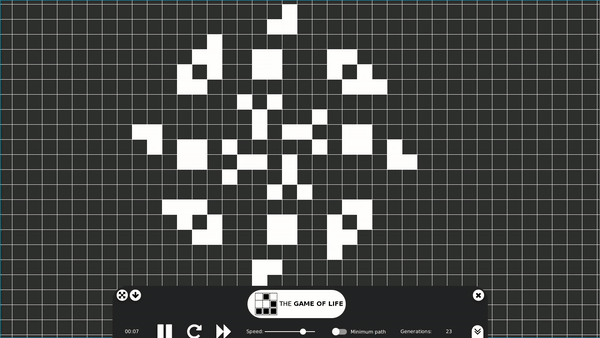

# Conway's Game Of Life

The current project is intended to implement the “Conway's Game of Life” developed by the mathematician John Horton Conway. This is a cellular automaton in a zero-player game based on three simple rules.

1. Any live cell with two or three live neighbours survives.

2. Any dead cell with three live neighbours becomes a live cell.

3.All other live cells die in the next generation. Similarly, all other dead cells stay dead.

The universe of the Game of Life is an infinite, two-dimensional orthogonal grid of square cells, each of which is in one of two possible states, live or dead, (or populated and unpopulated, respectively). Every cell interacts with its eight neighbours, which are the cells that are horizontally, vertically, or diagonally adjacent. At each step in time, the following transitions occur.

The initial pattern constitutes the seed of the system. The first generation is created by applying the above rules simultaneously to every cell in the seed; births and deaths occur simultaneously, and the discrete moment at which this happens is sometimes called a tick. Each generation is a pure function of the preceding one. The rules continue to be applied repeatedly to create further generations.

# Documentation

The detailed documentation can be found [here](https://docs.google.com/document/d/18sNvl-EX905nPFo6rOp-BpPIS403qZXTN5X4uRgFKOY/edit?usp=sharing)

